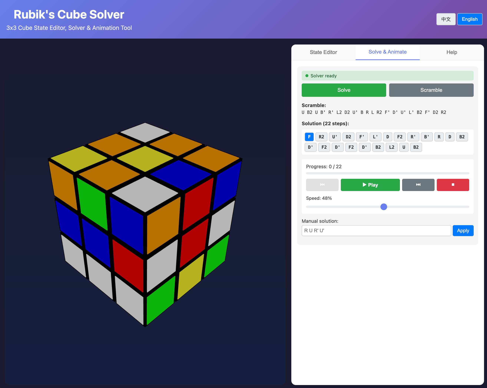

# Rubik's Cube Solver

A 3x3 Rubik's Cube state editor, solver, and animation visualization tool built with React, Three.js, and TypeScript.



**Demo: [https://reinmind.github.io/](https://reinmind.github.io/)**

## Features

- **3D Visualization**: Interactive 3D cube view with orbit controls (drag to rotate view, scroll to zoom)
- **State Editor**: Edit cube state by clicking cells or input state string
- **Rotation Operations**: Execute U, D, F, B, L, R rotations with animated transitions
- **Auto Solver**: Solve any valid cube state using the Kociemba two-phase algorithm
- **Animation Playback**: Step-by-step animation with play/pause/speed controls
- **Multi-language Support**: Switch between Chinese and English interfaces

## Getting Started

### Prerequisites

- Node.js 18+
- npm or yarn

### Installation

```bash
# Clone the repository
git clone https://github.com/reinmind/rubiks-cube-solver
cd cube

# Install dependencies
npm install

# Start development server
npm run dev
```

### Build for Production

```bash
npm run build
```

## Usage

### 3D View Controls

- **Drag**: Rotate the cube view
- **Scroll**: Zoom in/out

### State Editor Tab

1. Click **Edit: OFF** to enable edit mode
2. Select a color from the color picker
3. Click cells in the 2D unfolded view to change colors
4. Use rotation buttons (U/U'/D/D' etc.) to perform rotations
5. Enter a state string to set cube state directly
6. Click **Validate** to check if the state is valid

### Solve & Animate Tab

1. Click **Scramble** to generate a random scramble
2. Click **Solve** to get the solution
3. Use playback controls:
   - ▶ Play / ⏸ Pause
   - ⏮ Step backward
   - ⏭ Step forward
   - ⏹ Stop and reset
4. Adjust speed with the slider
5. Click solution steps to jump to that position

### State String Format

54 characters representing the cube state in order: U(9) + R(9) + F(9) + D(9) + L(9) + B(9)

Each face is read left-to-right, top-to-bottom:

```
Face layout:     Character meanings:
  U              U = Yellow
L F R B          R = Red
  D              F = Blue
                 D = White
                 L = Orange
                 B = Green
```

Example solved state:
```
UUUUUUUUURRRRRRRRRFFFFFFFFFDDDDDDDDDLLLLLLLLLBBBBBBBBB
```

### Cube Color Scheme

| Face | Position | Color |
|------|----------|-------|
| U | Up | Yellow |
| D | Down | White |
| F | Front | Blue |
| B | Back | Green |
| L | Left | Orange |
| R | Right | Red |

## Tech Stack

- **React 19** - UI framework
- **TypeScript** - Type safety
- **Vite** - Build tool
- **Three.js / React Three Fiber** - 3D rendering
- **Zustand** - State management
- **cube.js** - Kociemba solver algorithm

## Project Structure

```
src/
├── components/
│   ├── App.tsx          # Main app component
│   ├── Cube3D.tsx       # 3D cube visualization
│   ├── CubeEditor.tsx   # State editor panel
│   ├── SolutionPanel.tsx # Solver and animation controls
│   └── HelpPanel.tsx    # Usage instructions
├── core/
│   ├── Cube.ts          # Cube state and rotation logic
│   └── CubeValidator.ts # State validation
├── hooks/
│   └── useCubeStore.ts  # Zustand store
├── solver/
│   └── Solver.ts        # Web Worker solver
├── types/
│   └── cube.ts          # TypeScript types
├── i18n.ts              # Internationalization
└── App.css              # Styles
```

## Solver Details

The solver uses the **Kociemba two-phase algorithm**:

1. **Phase 1**: Reduce to a subgroup where only 180° turns are needed
2. **Phase 2**: Solve from the reduced subgroup

The solver runs in a **Web Worker** to prevent UI blocking during computation. For states that may be unsolvable, a 30-second timeout is implemented.

## Animation System

- Smooth rotation animations using Three.js quaternions
- Support for single rotations (U, U') and double rotations (U2)
- Configurable animation speed
- Real-time state updates after each rotation

## Browser Support

- Chrome (recommended)
- Firefox
- Safari
- Edge

Requires WebGL support for 3D rendering.

## License

MIT
